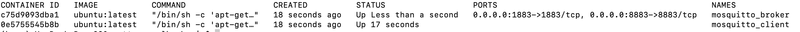

# TP SÉCURITÉ DU MQTT

Création de 2 conteneurs Docker :
- Un conteneur mosquitto broker.
- Un conteneur mosquitto client.

1. Créer un répertoire :
   ```bash
   mkdir mqtts
   cd mqtts
2. Instanciation des conteneurs et ressources associées définies dans le fichier docker-compose.yaml
```bash
docker-compose up -d
```
3. On vérifie les conteneurs créés :
```bash
docker ps
```


4. Exécuter d'un processus à l'intérieur du conteneur broker :
```bash
docker exec -it mosquitto_broker /bin/bash
```
5. Modifier la configuration de mosquitto pour fonctionner sur le port 8883 avec des certificats :
```bash
nano /etc/mosquitto/mosquitto.conf
```
6. Ajouter en fin de fichier la configuration suivante:
```bash
listener 8883
cafile /ca.crt
certfile /server.crt
keyfile /server.key
```
7. Créer un certificat CA (qui signe le certificat serveur) :
```bash
openssl req -new -x509 -days 1826 -extensions v3_ca -keyout ca.key -out ca.crt
```
8. Générer un certificat serveur et une clé :
Créer une clé serveur :
```bash
openssl genrsa -out server.key 2048
```
10. Créer une demande de signature de certificat (CSR) :
```bash
openssl req -out server.csr -key server.key -new
```

12. Signer le CSR avec le certificat CA pour obtenir le certificat serveur :
```bash
openssl x509 -req -in server.csr -CA ca.crt -CAkey ca.key -CAcreateserial -out server.crt -days 360
```

13. Relancer le service mosquitto :
```bash
service mosquitto restart
```

14. Copier le fichier ca.crt (représente le certificat de l'Autorité de Certification) sur le client mosquitto (en 2 étapes) :
Copier tout d'abord ca.crt du broker sur la machine host :
```bash
docker cp mosquitto_broker:/ca.crt .
```

15. Copier le fichier ca.crt depuis le machine host vers le broker mosquitto :
```bash
docker cp ca.crt mosquitto_client:
```

16. Depuis le broker on s'abonne à un topic :
```bash
mosquitto_sub -h 172.27.0.2 -p 8883 --cafile /ca.crt -t your/topic
```

17. On se connecte sur le client :
```bash
docker exec -it mosquitto_client /bin/bash
```

18. Depuis le client mosquitto, on publie :
```bash
mosquitto_pub -h 172.27.0.2 -p 8883 --cafile /ca.crt -t your/topic -m "Hello world"
```


